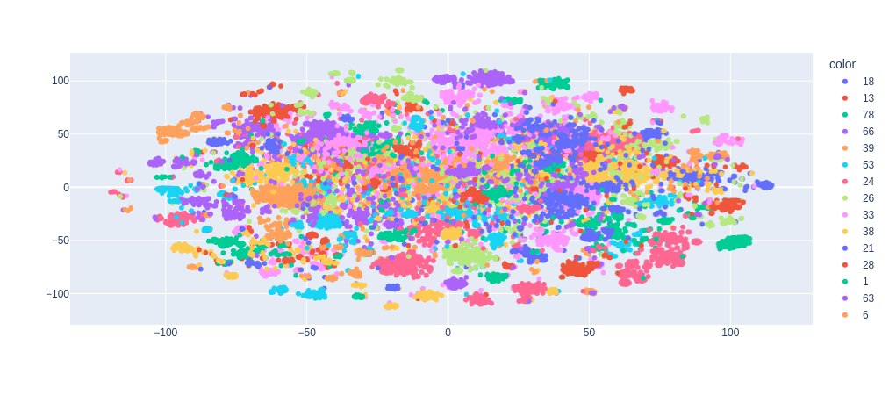

# Challenge titre Juritrack

Objectif: Utiliser uniquement les titres afin de determiner une typologie pertinente.

pip install -e . pour installer le projet

## Méthode 

La typologie des titres ne peut se faire qu'avec un expert métier. Il est possible de guider une campagne d'annotation via des modèle ML afin d'économiser le nombre d'exemple à évaluer.
Pour cela, nous allons entrainer un classifier qui va produire un score de confiance. 

1) Utilisation d'un modèle embedding entrainée sur des données juridique française.
2) Clustering via les embeddings afin de determiner des groupes similaires
3) Modèle de classification afin de valider la pertinence des groupes.

## Résultats

98 cluster trouvé voir clusteurs_info.csv pour les exemple "types"  
Classifer avec un macro average 0.83 pour 98 classes. (voir classification report dans le dossier data/report)  
Voir l'agencement des clusters dans eda.ipynb.  
Modèle prêt XGBOOST qui peut être utiliser dans CleanLab pour une campagne d'annotation via ActiveLearning.

## Pistes d'amelioration

- Supprimer si inutile: géolocation (communes, région ...), date et personnes physique des titres. On peut imaginer des regex ou des NER pour le faire.
- Utiliser le contenu des docs
- Améliorer les partie ML : cross-encoder, LLM, k-médoide, finetuning des hyperparamètres ...
